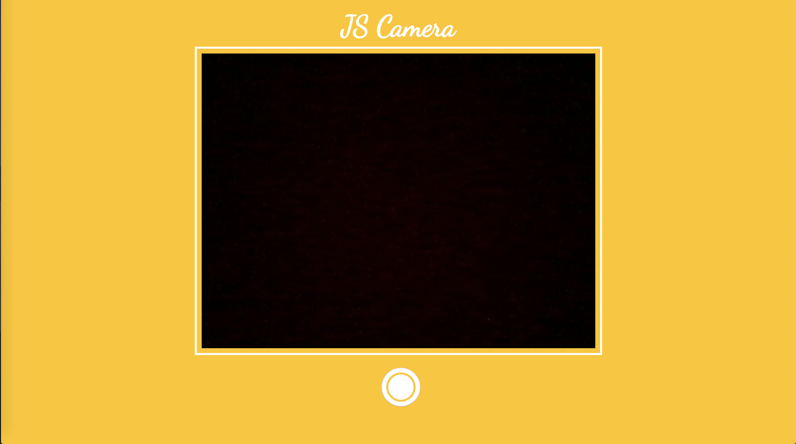

# js-camera

js-camera is a simple browser camera application made with pure js, html and css. You can click photos and download them. You should allow usage of camera from browser when asked.

 Features of this application:
  - Click a photo.
  - Download photos by clicking on it in timeline.

 ##### Below is a screenshot for the application:
 <p align="center">
  
</p>

### Getting Started

js-camera requires [Node.js](https://nodejs.org/) to run as it use browser-sync dependency of node.

Install the dependencies and start the dev server.

```sh
$ cd js-camera
$ npm install
$ npm start
```
Then open (http://localhost:3002) to see the application working. And yes now you have a browser based camera.